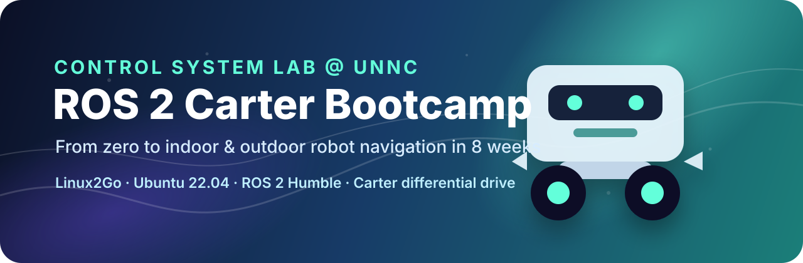
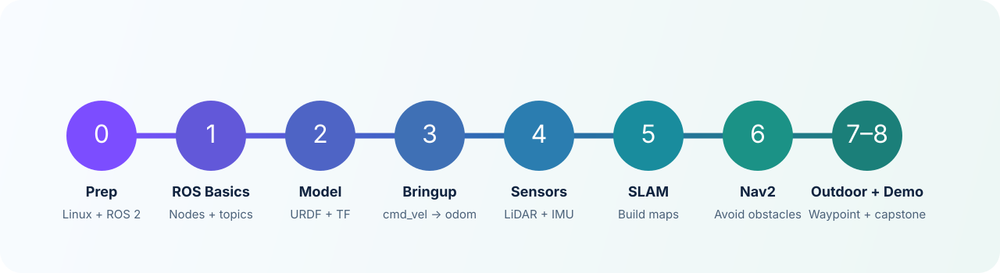

<p align="center">
  
</p>

<p align="center">
  <a href="https://docs.ros.org/en/humble/"></a>
  <a href="https://ubuntu.com/download/desktop"></a>
  <a href="https://control-system-lab-at-unnc.github.io/homepage-v2/"></a>
  
</p>

<h1 align="center">🤖 ROS 2 Carter Bootcamp</h1>

<p align="center">
  <b>From a blank terminal to a robot that can map, localize, navigate, avoid obstacles, and tell a story with data.</b>
</p>

<p align="center">
  <a href="#-start-here">Start Here</a> ·
  <a href="docs/course_outline_en.md">English Course Outline</a> ·
  <a href="docs/course_outline_zh.md">中文课程大纲</a> ·
  <a href="docs/asking_questions.md">How to Ask Questions</a> ·
  <a href="https://control-system-lab-at-unnc.github.io/homepage-v2/">Lab Homepage</a>
</p>

---

## 🌟 Why this bootcamp exists

Robotics becomes real the moment software touches hardware.

A line of code becomes wheel motion.  
A coordinate frame becomes a physical pose.  
A LiDAR scan becomes a map.  
A map becomes a plan.  
A plan becomes a robot quietly finding its way through the world.

This bootcamp is designed to guide students through that transformation. Over 8 formal teaching weeks, you will start with Linux and ROS 2 basics, then gradually build a complete mobile robot navigation stack on our **Carter differential-drive robot platform**.

The goal is not to memorize commands. The goal is to develop the instinct of a robotics engineer:

> **observe → measure → debug → test → document → improve**

---

## 🚀 What is ROS 2, and why should you care?

**ROS 2** is the shared language of modern robot software. It connects robot drivers, sensors, algorithms, simulations, visualization tools, and navigation stacks into one distributed system.

In research, ROS 2 helps a lab prototype become reproducible.  
In engineering, ROS 2 helps separate messy robot systems into testable modules.  
In industry, ROS 2 and the surrounding ecosystem are increasingly used as the foundation for mobile robots, manipulation, simulation, perception, navigation, and factory automation.

ROS 2 is not magic. It will not make a robot autonomous by itself.  
But it gives you the infrastructure to build autonomy without reinventing every wheel.

| What ROS 2 gives you | Why it matters in this course |
|---|---|
| 🧩 Nodes, topics, services, actions | Split robot software into understandable pieces |
| 🧭 TF coordinate transforms | Explain where every sensor and robot body is |
| 📦 Packages and launch files | Turn experiments into reusable systems |
| 🎥 RViz, rosbag, CLI tools | See, record, replay, and debug robot behavior |
| 🗺️ Nav2, SLAM Toolbox, robot_localization | Build the navigation stack that makes Carter move intelligently |
| 🌍 Community ecosystem | Learn skills that transfer across labs, robots, and companies |

Useful starting points:

- [ROS 2 Humble Documentation](https://docs.ros.org/en/humble/)
- [ROS 2 Tutorials](https://docs.ros.org/en/humble/Tutorials.html)
- [Nav2 Documentation](https://docs.nav2.org/)
- [ROS-Industrial](https://rosindustrial.org/)
- [Control System Lab @ UNNC](https://control-system-lab-at-unnc.github.io/homepage-v2/)

---

## 🎯 Project goal

This repository is the **course hub** for the ROS 2 Carter Bootcamp.

It is where students, teaching assistants, and instructors will find:

- 📣 course announcements;
- 🗓️ weekly plans and checkpoints;
- 🧪 lab instructions and starter code;
- 🖥️ lecture slides, updated before each Monday lecture;
- 🧰 Carter bringup resources;
- 🧭 debugging checklists;
- 📚 curated learning resources;
- 🧑‍🔧 question templates and clinic expectations;
- 🏁 final project requirements.

By the end of the bootcamp, each team should be able to make Carter:

```text
receive /cmd_vel
  ↓
move as a differential-drive robot
  ↓
publish odometry and TF
  ↓
read LiDAR and IMU data
  ↓
estimate robot state
  ↓
build an indoor map
  ↓
localize inside the map
  ↓
navigate with Nav2
  ↓
avoid obstacles
  ↓
perform basic outdoor waypoint navigation
  ↓
explain what worked, what failed, and why
```

<p align="center">
  
</p>

---

## 🧭 Start here

| If you are... | Go here |
|---|---|
| 🧑‍🎓 A student joining the course | Read [Week 0 preparation](#-week-0-preparation-now--2026-06-08) and [How to ask questions](docs/asking_questions.md) |
| 🧑‍🏫 A teaching assistant | Check the weekly checkpoint table and clinic format |
| 🤖 Working on Carter hardware | Start from the Carter interface convention and safety rules |
| 🧪 Looking for the full schedule | Open the [English outline](docs/course_outline_en.md) or [中文课程大纲](docs/course_outline_zh.md) |
| 📢 Looking for slides | Check the `slides/` folder before each Monday lecture |

---

## 📚 Course documents

| Document | Language | Purpose |
|---|---:|---|
| [📘 Course Outline - English](docs/course_outline_en.md) | English | Full 8-week structure, weekly tasks, checkpoints, deliverables |
| [📗 课程大纲 - 中文](docs/course_outline_zh.md) | 中文 | 中文版完整课程计划、每周任务、验收要求 |
| [🧠 How to Ask Questions](docs/asking_questions.md) | EN / 中文 | How to prepare logs, screenshots, rosbag files, and reproducible questions |
| [🏫 Control System Lab @ UNNC](https://control-system-lab-at-unnc.github.io/homepage-v2/) | Website | Organizer / lab homepage |

> 📌 **Slides policy:** weekly slides will be updated in `slides/` before the Monday lecture of that week.

---

## 🗓️ Timeline

> Week 0 is a preparation window before the formal bootcamp starts.  
> The Linux2Go teaching system will be distributed on **2026-06-08**.

| Phase | Time | Focus | Output |
|---|---|---|---|
| 🧰 Week 0 | Now → 2026-06-08 | VMware, Ubuntu 22.04, ROS 2 Humble basics | Students can use terminal, install software, run ROS 2 demos |
| 🧩 Week 1 | Formal week 1 | ROS 2 basics and tools | Publisher, subscriber, launch file, rosbag |
| 🧱 Week 2 | Formal week 2 | Carter model, URDF, Xacro, TF | Robot model + TF tree |
| ⚙️ Week 3 | Formal week 3 | Carter base bringup | `/cmd_vel` → wheels → `/odom` |
| 👀 Week 4 | Formal week 4 | LiDAR, IMU, rosbag, EKF | Sensor validation + filtered odometry |
| 🗺️ Week 5 | Formal week 5 | Indoor SLAM | Indoor map + mapping report |
| 🧭 Week 6 | Formal week 6 | Nav2 indoor navigation | Single-goal, multi-goal, obstacle avoidance |
| 🌤️ Week 7 | Formal week 7 | Outdoor waypoint navigation | GPS / RTK or outdoor waypoint demo |
| 🏁 Week 8 | Formal week 8 | Capstone integration | Final demo + report + reproducible evidence |

---

## 🔁 Weekly rhythm

Every week follows the same rhythm so that learning, debugging, and validation stay connected.

| Day | Session | Vibe | What happens |
|---|---|---|---|
| Monday afternoon | 🎙️ Lecture + guided lab | Learn and start | New concepts, live demo, starter task, updated slides |
| Wednesday afternoon | 🩺 Clinic | Diagnose and unblock | Bring logs, screenshots, TF tree, rosbag, and current failure |
| Friday afternoon | ✅ Q&A + checkpoint | Prove and reflect | Weekly demo, code/parameter review, failure analysis |

This structure is intentional: mobile robotics is cumulative. If odometry is wrong in Week 3, SLAM will suffer in Week 5, and Nav2 will look “mysterious” in Week 6.

---

## 🧰 Week 0 preparation: now → 2026-06-08

Before Linux2Go is distributed, students should slowly explore:

- 🖥️ VMware Workstation / VMware Fusion or another virtual machine tool;
- 🐧 Ubuntu 22.04;
- 💻 Linux terminal basics;
- 🤖 ROS 2 Humble installation and beginner demos;
- 🧠 the habit of asking reproducible technical questions.

Suggested Week 0 resources:

- [Ubuntu Desktop Download](https://ubuntu.com/download/desktop)
- [Ubuntu 22.04 Releases](https://releases.ubuntu.com/22.04/)
- [ROS 2 Humble Installation](https://docs.ros.org/en/humble/Installation.html)
- [ROS 2 Humble Tutorials](https://docs.ros.org/en/humble/Tutorials.html)

Suggested commands to try:

```bash
pwd
ls
cd
mkdir
touch
cp
mv
rm
cat
less
grep
find
chmod
sudo apt update
```

Suggested ROS 2 smoke test:

```bash
source /opt/ros/humble/setup.bash
ros2 --help
ros2 doctor
ros2 run demo_nodes_cpp talker
ros2 run demo_nodes_py listener
```

---

## 💬 How to ask questions

In this course, asking a good question is part of the engineering training.

We will use the spirit of [How To Ask Questions The Smart Way / 提问的智慧](https://github.com/ryanhanwu/How-To-Ask-Questions-The-Smart-Way/tree/main): respect other people's debugging time, show what you tried, and make the problem reproducible.

Before posting a question or coming to clinic, prepare:

```text
1. What were you trying to achieve?
2. What command did you run?
3. What did you expect to happen?
4. What actually happened?
5. What error message or log did you see?
6. What have you already tried?
7. Can you provide screenshots, TF tree, topic list, rosbag, or parameter files?
```

A good robotics question often includes:

```bash
ros2 node list
ros2 topic list
ros2 topic hz /scan
ros2 topic echo /odom --once
ros2 run tf2_tools view_frames
ros2 doctor
```

Read the full course-specific guide here: [🧠 How to Ask Questions](docs/asking_questions.md).

---

## 🤖 Carter robot interface convention

To make the course scalable, Carter should expose a consistent ROS 2 interface.

### Required input

```text
/cmd_vel                         geometry_msgs/msg/Twist or TwistStamped
```

### Required outputs

```text
/odom                            nav_msgs/msg/Odometry
/tf                              odom -> base_link or base_footprint
/joint_states                    sensor_msgs/msg/JointState
/scan                            sensor_msgs/msg/LaserScan
/imu                             sensor_msgs/msg/Imu
/battery_state                   sensor_msgs/msg/BatteryState, optional
/diagnostics                     diagnostic_msgs/msg/DiagnosticArray, optional
```

### Expected launch files

```text
carter_bringup.launch.py
carter_description.launch.py
carter_sensors.launch.py
carter_localization.launch.py
carter_mapping.launch.py
carter_navigation.launch.py
```

---

## 🧯 Safety rules

Real robots are not simulations. Treat Carter as a moving machine.

- Keep speed low during early bringup.
- Keep one person ready for emergency stop.
- Never test navigation in a crowded area.
- Do not stand in front of the robot during first motion tests.
- Use a lifted / supported robot for wheel direction and encoder tests.
- Always verify `/cmd_vel` timeout and manual override behavior.
- Stop the robot first; debug later.

---

## 🗂️ Repository structure

```text
ros2-carter-bootcamp/
├── README.md
├── assets/
│   ├── banner.svg
│   └── course_map.svg
├── docs/
│   ├── course_outline_en.md
│   ├── course_outline_zh.md
│   └── asking_questions.md
├── slides/
│   └── .gitkeep
├── labs/
│   └── .gitkeep
├── assignments/
│   └── .gitkeep
├── checklists/
│   └── .gitkeep
├── carter_examples/
│   └── .gitkeep
├── resources/
│   └── .gitkeep
└── .github/
    └── ISSUE_TEMPLATE/
        ├── question.md
        └── robot_debug.md
```

---

## 🏁 Final destination

By the end of the bootcamp, a successful team will not only have a robot that moves.

A successful team will have a robot system that can be explained:

- what each node does;
- what each topic means;
- how each frame is connected;
- why the robot believes it is at a certain pose;
- why navigation succeeds or fails;
- what data proves the result.

That is the difference between “the robot worked once” and “we engineered a robot system.”

---

<p align="center">
  Built with curiosity, logs, maps, bags, failed tests, and a lot of patience. <br>
  <b>Control System Lab @ UNNC</b> · <a href="https://control-system-lab-at-unnc.github.io/homepage-v2/">Homepage</a>
</p>
