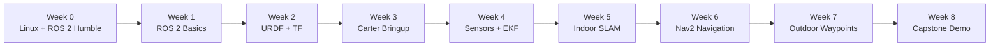

# 📘 ROS 2 Carter Bootcamp — Course Outline

<p align="center">
  
</p>

> **Language:** English  
> **Duration:** Week 0 preparation + 8 formal teaching weeks  
> **Platform:** Linux2Go · Ubuntu 22.04 · ROS 2 Humble · Carter differential-drive robot  
> **Organizer:** [Control System Lab @ UNNC](https://control-system-lab-at-unnc.github.io/homepage-v2/)  
> **Slides:** updated in `slides/` before each Monday lecture  
> **Question guide:** [How to Ask Questions](asking_questions.md)

---

## 1. 🌟 Course positioning

This bootcamp is a practical mobile robotics systems course.

It is not a pure ROS 2 command tutorial. It is a guided journey from:

```text
"How do I open a terminal?"
        ↓
"How do ROS 2 nodes communicate?"
        ↓
"Why does the robot think it is here?"
        ↓
"Why does Nav2 refuse to move?"
        ↓
"How can I prove my robot actually worked?"
```

The final goal is for each student team to build, debug, and explain a working Carter-based navigation system.

---

## 2. 🎯 Final practical target

By the end of Week 8, each team should be able to demonstrate a Carter robot that can:

- receive velocity commands through `/cmd_vel`;
- move as a differential-drive mobile robot;
- publish `/odom`, `/tf`, `/joint_states`, `/scan`, and `/imu`;
- use wheel odometry and IMU for state estimation;
- create an indoor 2D map;
- localize in the map;
- navigate to one or multiple indoor goals with Nav2;
- avoid simple static and dynamic obstacles;
- perform basic outdoor waypoint navigation when GPS / RTK is available;
- document the experiment with commands, screenshots, maps, parameters, logs, and rosbag files.

---

## 3. 👥 Expected students

This course is designed for sophomore and junior undergraduate students with engineering or science backgrounds.

Recommended background:

- basic Python or C++ programming;
- basic mathematics and physics;
- willingness to use Linux terminal tools;
- willingness to debug software and hardware in teams;
- curiosity about robotics, control, autonomy, AI systems, or mechatronics.

No prior ROS 2 experience is required.

---

## 4. 🔁 Weekly rhythm

Each formal week follows a stable rhythm.

| Day | Session | Main purpose | Student output |
|---|---|---|---|
| Monday afternoon | 🎙️ Lecture + guided lab | Learn new concepts and start the weekly task | Run the starter demo and understand the goal |
| Wednesday afternoon | 🩺 Clinic | Diagnose problems and unblock teams | Bring logs, screenshots, TF tree, topic list, rosbag |
| Friday afternoon | ✅ Q&A + checkpoint | Verify progress and reflect | Demo, submit evidence, explain failures |

> 📌 Weekly slides will be updated before the Monday lecture of that week.

---

## 5. 🧭 Learning pathway



---

## 6. 🧰 Week 0 — Preparation before Linux2Go

### Time

**Now → 2026-06-08**

The official Linux2Go teaching system will be distributed on **2026-06-08**. Before that, students are encouraged to slowly explore VMware, Ubuntu, Linux terminal tools, and ROS 2 Humble.

### Goals

Students should become comfortable with:

- virtual machines;
- Ubuntu 22.04;
- basic Linux commands;
- software installation with `apt`;
- ROS 2 Humble installation;
- running basic ROS 2 demos;
- copying logs and asking reproducible questions.

### Suggested tasks

- Install VMware Workstation, VMware Fusion, or another virtual machine tool.
- Create an Ubuntu 22.04 virtual machine.
- Practice terminal commands.
- Try installing ROS 2 Humble.
- Run the `talker` and `listener` examples.
- Read the ROS 2 beginner tutorials.

### Useful commands

```bash
pwd
ls
cd
mkdir
touch
cp
mv
rm
cat
less
grep
find
chmod
sudo apt update
sudo apt install
```

### ROS 2 smoke test

```bash
source /opt/ros/humble/setup.bash
ros2 --help
ros2 doctor
ros2 run demo_nodes_cpp talker
ros2 run demo_nodes_py listener
```

### Resources

- [Ubuntu Desktop Download](https://ubuntu.com/download/desktop)
- [Ubuntu 22.04 Releases](https://releases.ubuntu.com/22.04/)
- [ROS 2 Humble Installation](https://docs.ros.org/en/humble/Installation.html)
- [ROS 2 Humble Tutorials](https://docs.ros.org/en/humble/Tutorials.html)

### Checkpoint

Before Week 1, students should be able to explain:

- what a virtual machine is;
- what Ubuntu is;
- how to open and use a terminal;
- what ROS 2 Humble is;
- what a node and a topic roughly mean;
- how to copy a terminal log into a GitHub Issue or clinic note.

---

## 7. 🤖 Week 1 — ROS 2 basics and toolchain

### Monday lecture + guided lab

Topics:

- ROS 2 computation graph;
- workspace and package structure;
- nodes and topics;
- messages;
- services and actions;
- parameters;
- launch files;
- `ros2` CLI tools;
- `rqt_graph`;
- `rosbag2`;
- package creation and build workflow.

Guided lab:

- create a ROS 2 workspace;
- create a Python package;
- write a publisher;
- write a subscriber;
- start nodes with a launch file;
- record and replay a rosbag.

### Wednesday clinic

Focus:

- Linux2Go / environment issues;
- `colcon build` failures;
- `source install/setup.bash` issues;
- package discovery problems;
- ROS 2 command-line usage.

Students should bring:

```bash
echo $ROS_DISTRO
echo $AMENT_PREFIX_PATH
colcon build --symlink-install
ros2 node list
ros2 topic list
```

### Friday checkpoint

Deliverables:

- one publisher node;
- one subscriber node;
- one launch file;
- one short rosbag;
- screenshot of `rqt_graph`;
- short note explaining the difference between node, topic, service, and action.

---

## 8. 🧱 Week 2 — Carter modeling, URDF, Xacro, and TF

### Monday lecture + guided lab

Topics:

- differential-drive kinematics;
- `/cmd_vel` meaning;
- robot links and joints;
- URDF and Xacro;
- `robot_state_publisher`;
- static and dynamic transforms;
- TF tree design;
- common frames: `map`, `odom`, `base_footprint`, `base_link`, `laser_link`, `imu_link`.

Guided lab:

- create `carter_description`;
- write a simplified Carter URDF / Xacro;
- display the model in RViz;
- generate a TF tree.

### Wednesday clinic

Focus:

- missing links;
- incorrect wheel placement;
- broken TF tree;
- wrong sensor frame;
- RViz display errors.

Students should bring:

```bash
ros2 run tf2_tools view_frames
ros2 run tf2_ros tf2_echo base_link laser_link
ros2 topic echo /joint_states --once
```

### Friday checkpoint

Deliverables:

- `carter_description` package;
- `display.launch.py`;
- RViz screenshot;
- TF tree screenshot / PDF;
- one-page explanation of the Carter frame convention.

---

## 9. ⚙️ Week 3 — Carter base bringup and differential-drive control

### Monday lecture + guided lab

Topics:

- converting `/cmd_vel` to left/right wheel velocity;
- encoder ticks to wheel speed;
- odometry basics;
- `ros2_control`;
- `diff_drive_controller`;
- velocity limits and acceleration limits;
- watchdog and emergency stop;
- safe first-motion procedures.

Guided lab:

- test the base driver in simulation or fake hardware mode;
- command slow forward motion;
- test rotation;
- check encoder signs;
- publish `/odom` and `odom -> base_link`.

### Wednesday clinic

Focus:

- wheel direction;
- encoder sign;
- `/cmd_vel` not received;
- odometry jumps;
- TF not published;
- unsafe speed settings.

Students should bring:

```bash
ros2 topic echo /cmd_vel
ros2 topic echo /joint_states --once
ros2 topic echo /odom --once
ros2 run tf2_ros tf2_echo odom base_link
```

### Friday checkpoint

Each team should demonstrate:

- straight-line motion;
- in-place rotation;
- a small square trajectory;
- stable `/odom`;
- valid `/tf`;
- a safe stop behavior.

This is the first major gate. If the base is unreliable, later SLAM and Nav2 will be unreliable.

---

## 10. 👀 Week 4 — LiDAR, IMU, rosbag, and state estimation

### Monday lecture + guided lab

Topics:

- `sensor_msgs/LaserScan`;
- `sensor_msgs/Imu`;
- timestamp and `frame_id`;
- sensor placement and TF;
- rosbag for reproducible experiments;
- raw odometry vs. filtered odometry;
- `robot_localization`;
- EKF configuration.

Guided lab:

- visualize LiDAR scan in RViz;
- check IMU orientation and noise;
- record Carter motion;
- configure EKF;
- compare raw `/odom` and filtered odometry.

### Wednesday clinic

Focus:

- `/scan` frame errors;
- unstable LiDAR rate;
- IMU orientation mismatch;
- EKF not publishing;
- bag playback issues;
- timestamp problems.

Students should bring:

```bash
ros2 topic hz /scan
ros2 topic echo /imu --once
ros2 topic echo /odometry/filtered --once
ros2 bag info <bag_folder>
```

### Friday checkpoint

Deliverables:

- short Carter motion rosbag;
- `ekf.yaml`;
- raw odometry vs. filtered odometry comparison;
- sensor TF checklist;
- screenshot of LiDAR in RViz.

---

## 11. 🗺️ Week 5 — Indoor SLAM

### Monday lecture + guided lab

Topics:

- 2D SLAM overview;
- scan matching;
- pose graph intuition;
- loop closure;
- SLAM Toolbox;
- map resolution;
- good mapping route design;
- saving `map.yaml` and map image.

Guided lab:

- run SLAM Toolbox;
- map a simple indoor environment;
- save a map;
- replay a mapping bag;
- inspect map quality.

### Wednesday clinic

Focus:

- duplicated walls;
- drifting odometry;
- wrong LiDAR frame;
- poor mapping route;
- moving obstacles;
- map save/load issues.

Students should bring:

```bash
ros2 topic hz /scan
ros2 topic echo /odom --once
ros2 run tf2_tools view_frames
ros2 bag info <mapping_bag>
```

### Friday checkpoint

Deliverables:

- indoor map file (`map.yaml` + image);
- mapping launch file;
- mapping rosbag;
- map quality report;
- at least one failure case and analysis.

---

## 12. 🧭 Week 6 — Nav2 indoor navigation and obstacle avoidance

### Monday lecture + guided lab

Topics:

- Nav2 architecture;
- map server;
- localization;
- planner server;
- controller server;
- behavior tree navigator;
- global and local costmaps;
- obstacle layer and inflation layer;
- RViz goal setting;
- tuning without superstition.

Guided lab:

- load the indoor map;
- set initial pose;
- send a single goal;
- inspect global path;
- inspect local costmap;
- tune a small set of safe parameters.

### Wednesday clinic

Focus:

- AMCL not converging;
- map frame mismatch;
- costmap not showing obstacles;
- global planner fails;
- controller produces no `/cmd_vel`;
- robot oscillates or gets stuck.

Students should bring:

```bash
ros2 node list | grep nav
ros2 topic list | grep costmap
ros2 topic echo /cmd_vel --once
ros2 run tf2_tools view_frames
```

### Friday checkpoint

Each team should demonstrate:

- single-goal indoor navigation;
- multi-goal navigation;
- simple dynamic obstacle avoidance;
- one failure case with root-cause analysis.

This is the second major gate. The goal is not perfect navigation; the goal is explainable navigation.

---

## 13. 🌤️ Week 7 — Outdoor waypoint navigation and GPS / RTK extension

### Monday lecture + guided lab

Topics:

- differences between indoor and outdoor navigation;
- GPS and RTK basics;
- `sensor_msgs/NavSatFix`;
- IMU heading;
- local EKF and global EKF concept;
- `navsat_transform_node`;
- waypoint following;
- outdoor safety procedures.

Guided lab:

- record outdoor sensor data;
- inspect GPS fix quality;
- configure a simple waypoint route;
- test low-speed outdoor motion;
- compare GPS / RTK behavior when available.

### Wednesday clinic

Focus:

- GPS fix unavailable;
- wrong coordinate conversion;
- IMU yaw instability;
- robot heading mismatch;
- unsafe outdoor test setup;
- waypoint file errors.

Students should bring:

```bash
ros2 topic echo /fix --once
ros2 topic echo /imu --once
ros2 topic echo /odometry/global --once
ros2 bag info <outdoor_bag>
```

### Friday checkpoint

Deliverables:

- outdoor waypoint file;
- outdoor bag or demo video;
- localization configuration;
- safety checklist;
- failure analysis.

If GPS / RTK is not reliable, the fallback target is:

- wheel odometry + IMU short-distance outdoor waypoint test;
- GPS data recording and offline analysis;
- simulation-based waypoint navigation demonstration.

---

## 14. 🏁 Week 8 — Capstone integration and final demo

### Monday lecture + guided lab

Topics:

- system integration;
- launch file organization;
- parameter management;
- reproducibility;
- final report structure;
- demo planning;
- failure storytelling.

Guided lab:

- assemble the complete bringup pipeline;
- check launch commands;
- verify TF tree;
- verify topics;
- record evidence.

### Wednesday clinic

Focus:

- final integration;
- launch file cleanup;
- map and parameter consistency;
- demo rehearsal;
- evidence collection.

### Friday final demo

Each team presents for 10–15 minutes:

- system architecture;
- Carter bringup;
- indoor map / localization;
- indoor navigation and obstacle avoidance;
- outdoor waypoint or fallback demonstration;
- failures and lessons learned;
- future improvements.

Final deliverables:

- Git repository;
- launch files;
- parameter files;
- map files;
- rosbag files;
- demo video;
- final report;
- reproducibility instructions.

---

## 15. 🧪 Assessment suggestion

| Component | Weight |
|---|---:|
| Weekly labs and evidence | 30% |
| Carter bringup checkpoint | 15% |
| Indoor SLAM + Nav2 navigation | 20% |
| Outdoor waypoint / GPS experiment | 15% |
| Capstone demo and report | 20% |

---

## 16. 🧯 Recovery paths

Robotics courses need fallback paths. If one stage fails, students should still be able to learn the next stage.

| Problem | Recovery path |
|---|---|
| Linux / ROS 2 environment fails | Use Linux2Go standard image |
| Carter driver not ready | Use instructor-provided base driver |
| Hardware access limited | Use simulation or recorded bags |
| Mapping fails | Use instructor-provided map |
| Nav2 parameters unstable | Start from conservative template parameters |
| GPS / RTK unreliable | Use outdoor bag analysis or simulation waypoint task |

---

## 17. 🏆 What success looks like

A strong final project is not necessarily the fastest robot.

A strong final project is one where the team can clearly explain:

- what each node does;
- what each topic carries;
- how each TF frame is connected;
- how odometry and sensor data affect localization;
- why Nav2 succeeds or fails;
- what evidence supports the final result;
- what they would improve next.

That is the engineering goal of this bootcamp.
