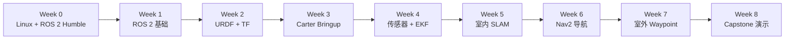

# 📗 ROS 2 Carter Bootcamp — 课程大纲

<p align="center">
  
</p>

> **语言：** 中文  
> **周期：** Week 0 预备期 + 8 周正式课程  
> **平台：** Linux2Go · Ubuntu 22.04 · ROS 2 Humble · Carter 差速底盘  
> **组织实验室：** [Control System Lab @ UNNC](https://control-system-lab-at-unnc.github.io/homepage-v2/)  
> **Slides：** 每周一上课前更新到 `slides/`  
> **提问指南：** [How to Ask Questions / 如何高效提问](asking_questions.md)

---

## 1. 🌟 课程定位

这是一门偏工程实践的移动机器人系统课程。

它不是单纯的 ROS 2 命令课，而是一条从零开始的真实机器人系统路线：

```text
“我怎么打开终端？”
        ↓
“ROS 2 node 之间怎么通信？”
        ↓
“机器人为什么认为自己在这里？”
        ↓
“为什么 Nav2 不愿意动？”
        ↓
“我如何证明我的机器人真的工作过？”
```

课程最终目标是让每个学生小组能够基于 Carter 差速底盘，搭建、调试、解释一个可以工作的移动机器人导航系统。

---

## 2. 🎯 最终实践目标

到 Week 8 结束时，每个小组应能够演示 Carter 完成：

- 通过 `/cmd_vel` 接收速度指令；
- 作为差速移动机器人稳定运动；
- 发布 `/odom`、`/tf`、`/joint_states`、`/scan`、`/imu`；
- 使用轮速里程计和 IMU 做状态估计；
- 构建室内 2D 地图；
- 在地图中完成定位；
- 使用 Nav2 完成一个或多个室内目标点导航；
- 避开简单静态和动态障碍；
- 在 GPS / RTK 条件允许时完成基础室外 waypoint 导航；
- 用命令、截图、地图、参数、日志和 rosbag 记录并解释实验结果。

---

## 3. 👥 适合学生

本课程面向具有工科或理科背景的大二、大三本科生。

建议基础：

- 基础 Python 或 C++ 编程能力；
- 基础数学与物理知识；
- 愿意使用 Linux 终端；
- 愿意在小组中调试软件和硬件；
- 对机器人、控制、自动驾驶、AI 系统或机电系统感兴趣。

课程不要求学生提前掌握 ROS 2。

---

## 4. 🔁 每周节奏

正式课程每周采用固定节奏。

| 时间 | 环节 | 主要目的 | 学生产出 |
|---|---|---|---|
| 周一下午 | 🎙️ 主课 + guided lab | 学习新概念，启动本周任务 | 跑通 starter demo，理解本周目标 |
| 周三下午 | 🩺 Clinic 工程问诊 | 集中诊断问题，帮助各组 unblock | 带日志、截图、TF tree、topic list、rosbag |
| 周五下午 | ✅ 答疑 + checkpoint | 检查进度，复盘失败 | 演示、提交证据、解释失败原因 |

> 📌 每周 slides 会在当周周一上课前更新。

---

## 5. 🧭 学习路线



---

## 6. 🧰 Week 0 — Linux2Go 发放前预备期

### 时间

**现在 → 2026-06-08**

正式 Linux2Go 教学系统将在 **2026-06-08** 发放。在此之前，建议同学们慢慢熟悉 VMware、Ubuntu、Linux 终端和 ROS 2 Humble。

### 目标

学生应逐步熟悉：

- 虚拟机；
- Ubuntu 22.04；
- 基础 Linux 命令；
- 使用 `apt` 安装软件；
- ROS 2 Humble 安装；
- 运行基础 ROS 2 demo；
- 复制日志并提出可复现的技术问题。

### 建议任务

- 安装 VMware Workstation、VMware Fusion 或其他虚拟机软件；
- 创建 Ubuntu 22.04 虚拟机；
- 练习终端命令；
- 尝试安装 ROS 2 Humble；
- 运行 `talker` 和 `listener` 示例；
- 阅读 ROS 2 beginner tutorials。

### 常用 Linux 命令

```bash
pwd
ls
cd
mkdir
touch
cp
mv
rm
cat
less
grep
find
chmod
sudo apt update
sudo apt install
```

### ROS 2 测试命令

```bash
source /opt/ros/humble/setup.bash
ros2 --help
ros2 doctor
ros2 run demo_nodes_cpp talker
ros2 run demo_nodes_py listener
```

### 参考资料

- [Ubuntu Desktop Download](https://ubuntu.com/download/desktop)
- [Ubuntu 22.04 Releases](https://releases.ubuntu.com/22.04/)
- [ROS 2 Humble Installation](https://docs.ros.org/en/humble/Installation.html)
- [ROS 2 Humble Tutorials](https://docs.ros.org/en/humble/Tutorials.html)

### Checkpoint

Week 1 前，学生应至少能够说明：

- 什么是虚拟机；
- Ubuntu 是什么；
- 如何打开并使用 terminal；
- ROS 2 Humble 是什么；
- node 和 topic 大概是什么意思；
- 如何把终端日志复制到 GitHub Issue 或 clinic 记录里。

---

## 7. 🤖 Week 1 — ROS 2 基础与工具链

### 周一主课 + guided lab

主题：

- ROS 2 计算图；
- workspace 与 package 结构；
- node 与 topic；
- message；
- service 与 action；
- parameter；
- launch 文件；
- `ros2` 命令行工具；
- `rqt_graph`；
- `rosbag2`；
- package 创建与构建流程。

实验：

- 创建 ROS 2 workspace；
- 创建 Python package；
- 编写 publisher；
- 编写 subscriber；
- 使用 launch 启动多个 node；
- 记录并回放 rosbag。

### 周三 clinic

重点：

- Linux2Go / 环境问题；
- `colcon build` 失败；
- `source install/setup.bash` 问题；
- package 找不到；
- ROS 2 命令使用。

建议携带信息：

```bash
echo $ROS_DISTRO
echo $AMENT_PREFIX_PATH
colcon build --symlink-install
ros2 node list
ros2 topic list
```

### 周五 checkpoint

提交：

- 一个 publisher node；
- 一个 subscriber node；
- 一个 launch 文件；
- 一段短 rosbag；
- `rqt_graph` 截图；
- 简短说明 node、topic、service、action 的区别。

---

## 8. 🧱 Week 2 — Carter 建模、URDF、Xacro 与 TF

### 周一主课 + guided lab

主题：

- 差速底盘运动学；
- `/cmd_vel` 的含义；
- robot link 与 joint；
- URDF 与 Xacro；
- `robot_state_publisher`；
- 静态 TF 与动态 TF；
- TF tree 设计；
- 常见坐标系：`map`、`odom`、`base_footprint`、`base_link`、`laser_link`、`imu_link`。

实验：

- 创建 `carter_description`；
- 编写简化 Carter URDF / Xacro；
- 在 RViz 中显示模型；
- 生成 TF tree。

### 周三 clinic

重点：

- link 缺失；
- 轮子位置不对；
- TF tree 断裂；
- 传感器 frame 错误；
- RViz 显示错误。

建议携带信息：

```bash
ros2 run tf2_tools view_frames
ros2 run tf2_ros tf2_echo base_link laser_link
ros2 topic echo /joint_states --once
```

### 周五 checkpoint

提交：

- `carter_description` package；
- `display.launch.py`；
- RViz 截图；
- TF tree 截图或 PDF；
- 一页 Carter 坐标系约定说明。

---

## 9. ⚙️ Week 3 — Carter 底盘 bringup 与差速控制

### 周一主课 + guided lab

主题：

- `/cmd_vel` 到左右轮速度；
- 编码器 tick 到轮速；
- 里程计基础；
- `ros2_control`；
- `diff_drive_controller`；
- 速度限制与加速度限制；
- watchdog 与急停；
- 第一次真机运动安全流程。

实验：

- 在仿真或 fake hardware 模式下测试底盘驱动；
- 低速前进；
- 原地旋转；
- 检查编码器正负号；
- 发布 `/odom` 和 `odom -> base_link`。

### 周三 clinic

重点：

- 左右轮方向；
- 编码器符号；
- `/cmd_vel` 没收到；
- `/odom` 跳变；
- TF 没发布；
- 速度设置不安全。

建议携带信息：

```bash
ros2 topic echo /cmd_vel
ros2 topic echo /joint_states --once
ros2 topic echo /odom --once
ros2 run tf2_ros tf2_echo odom base_link
```

### 周五 checkpoint

每组演示：

- 直线运动；
- 原地旋转；
- 小方形轨迹；
- 稳定 `/odom`；
- 有效 `/tf`；
- 安全停止行为。

这是课程第一个大关口。底盘不稳定，后面的 SLAM 和 Nav2 都会不稳定。

---

## 10. 👀 Week 4 — LiDAR、IMU、rosbag 与状态估计

### 周一主课 + guided lab

主题：

- `sensor_msgs/LaserScan`；
- `sensor_msgs/Imu`；
- timestamp 与 `frame_id`；
- 传感器位置与 TF；
- 使用 rosbag 复现实验；
- raw odometry 与 filtered odometry；
- `robot_localization`；
- EKF 配置。

实验：

- 在 RViz 中显示 LiDAR；
- 检查 IMU 方向与噪声；
- 记录 Carter 运动数据；
- 配置 EKF；
- 对比 raw `/odom` 与 filtered odometry。

### 周三 clinic

重点：

- `/scan` frame 错误；
- LiDAR 频率不稳定；
- IMU 方向不一致；
- EKF 不输出；
- bag 回放问题；
- 时间戳问题。

建议携带信息：

```bash
ros2 topic hz /scan
ros2 topic echo /imu --once
ros2 topic echo /odometry/filtered --once
ros2 bag info <bag_folder>
```

### 周五 checkpoint

提交：

- 一段 Carter 运动 rosbag；
- `ekf.yaml`；
- raw odometry 与 filtered odometry 对比；
- 传感器 TF 检查表；
- RViz 中 LiDAR 截图。

---

## 11. 🗺️ Week 5 — 室内 SLAM 建图

### 周一主课 + guided lab

主题：

- 2D SLAM 基本概念；
- scan matching；
- pose graph 直觉；
- loop closure；
- SLAM Toolbox；
- 地图分辨率；
- 好的建图路线设计；
- 保存 `map.yaml` 和地图图片。

实验：

- 运行 SLAM Toolbox；
- 在简单室内环境建图；
- 保存地图；
- 回放建图 bag；
- 检查地图质量。

### 周三 clinic

重点：

- 墙体重影；
- 里程计漂移；
- LiDAR frame 错误；
- 建图路线不好；
- 动态物体干扰；
- 地图保存和加载问题。

建议携带信息：

```bash
ros2 topic hz /scan
ros2 topic echo /odom --once
ros2 run tf2_tools view_frames
ros2 bag info <mapping_bag>
```

### 周五 checkpoint

提交：

- 室内地图文件（`map.yaml` + image）；
- mapping launch 文件；
- 建图 rosbag；
- 地图质量报告；
- 至少一个失败案例和原因分析。

---

## 12. 🧭 Week 6 — Nav2 室内导航与避障

### 周一主课 + guided lab

主题：

- Nav2 架构；
- map server；
- localization；
- planner server；
- controller server；
- behavior tree navigator；
- global costmap 与 local costmap；
- obstacle layer 与 inflation layer；
- RViz 发送目标点；
- 如何避免“玄学调参”。

实验：

- 加载室内地图；
- 设置 initial pose；
- 发送单点目标；
- 查看 global path；
- 查看 local costmap；
- 在安全范围内调整少量关键参数。

### 周三 clinic

重点：

- AMCL 不收敛；
- map frame 不匹配；
- costmap 不显示障碍；
- global planner 失败；
- controller 不输出 `/cmd_vel`；
- 机器人振荡或卡住。

建议携带信息：

```bash
ros2 node list | grep nav
ros2 topic list | grep costmap
ros2 topic echo /cmd_vel --once
ros2 run tf2_tools view_frames
```

### 周五 checkpoint

每组演示：

- 单点室内导航；
- 多点室内导航；
- 简单动态障碍避障；
- 一个失败案例和 root-cause 分析。

这是课程第二个大关口。目标不是完美导航，而是可解释的导航。

---

## 13. 🌤️ Week 7 — 室外 waypoint 导航与 GPS / RTK 扩展

### 周一主课 + guided lab

主题：

- 室内导航与室外导航的区别；
- GPS 与 RTK 基础；
- `sensor_msgs/NavSatFix`；
- IMU 航向；
- local EKF 与 global EKF 概念；
- `navsat_transform_node`；
- waypoint following；
- 室外测试安全流程。

实验：

- 记录室外传感器数据；
- 检查 GPS fix 质量；
- 配置简单 waypoint 路线；
- 低速室外运动测试；
- 在可用条件下对比 GPS / RTK 效果。

### 周三 clinic

重点：

- GPS 没有 fix；
- 坐标转换错误；
- IMU yaw 不稳定；
- 机器人航向不一致；
- 室外测试不安全；
- waypoint 文件错误。

建议携带信息：

```bash
ros2 topic echo /fix --once
ros2 topic echo /imu --once
ros2 topic echo /odometry/global --once
ros2 bag info <outdoor_bag>
```

### 周五 checkpoint

提交：

- 室外 waypoint 文件；
- 室外 bag 或演示视频；
- 定位配置文件；
- 安全 checklist；
- 失败案例分析。

如果 GPS / RTK 不稳定，则降级目标为：

- 轮速计 + IMU 的短距离室外 waypoint 测试；
- GPS 数据记录和离线分析；
- 仿真中的 waypoint navigation 演示。

---

## 14. 🏁 Week 8 — Capstone 集成与最终演示

### 周一主课 + guided lab

主题：

- 系统集成；
- launch 文件组织；
- 参数管理；
- 可复现实验；
- final report 结构；
- 演示流程设计；
- 如何讲清楚失败案例。

实验：

- 组装完整 bringup pipeline；
- 检查 launch 命令；
- 检查 TF tree；
- 检查 topic；
- 记录证据。

### 周三 clinic

重点：

- 最终集成；
- launch 文件清理；
- 地图和参数一致性；
- 演示排练；
- 证据收集。

### 周五 final demo

每组 10–15 分钟展示：

- 系统架构；
- Carter bringup；
- 室内地图 / 定位；
- 室内导航与避障；
- 室外 waypoint 或降级演示；
- 失败与经验总结；
- 未来改进方向。

最终提交：

- Git 仓库；
- launch 文件；
- 参数文件；
- 地图文件；
- rosbag 文件；
- 演示视频；
- final report；
- 复现实验说明。

---

## 15. 🧪 考核建议

| 项目 | 占比 |
|---|---:|
| 每周实验与证据提交 | 30% |
| Carter bringup checkpoint | 15% |
| 室内 SLAM + Nav2 导航 | 20% |
| 室外 waypoint / GPS 实验 | 15% |
| Capstone 演示与报告 | 20% |

---

## 16. 🧯 补救路径

机器人课程必须有 fallback。某一阶段失败时，学生仍然应该能继续学习下一阶段。

| 问题 | 补救路径 |
|---|---|
| Linux / ROS 2 环境失败 | 使用 Linux2Go 标准系统 |
| Carter driver 不稳定 | 使用教师提供的标准底盘驱动 |
| 真机数量不足 | 使用仿真或录制好的 rosbag |
| 建图失败 | 使用教师提供的标准地图继续 Week 6 |
| Nav2 参数不稳定 | 从保守参数模板开始 |
| GPS / RTK 不可靠 | 使用室外 bag 离线分析或仿真 waypoint 任务 |

---

## 17. 🏆 什么叫课程成功

一个优秀的 final project 不一定是跑得最快的机器人。

优秀的小组应该能够清楚解释：

- 每个 node 做什么；
- 每个 topic 传递什么；
- 每个 TF frame 如何连接；
- 里程计和传感器如何影响定位；
- Nav2 为什么成功或失败；
- 哪些证据支撑实验结果；
- 下一步应该如何改进。

这就是本课程真正希望训练的工程能力。
